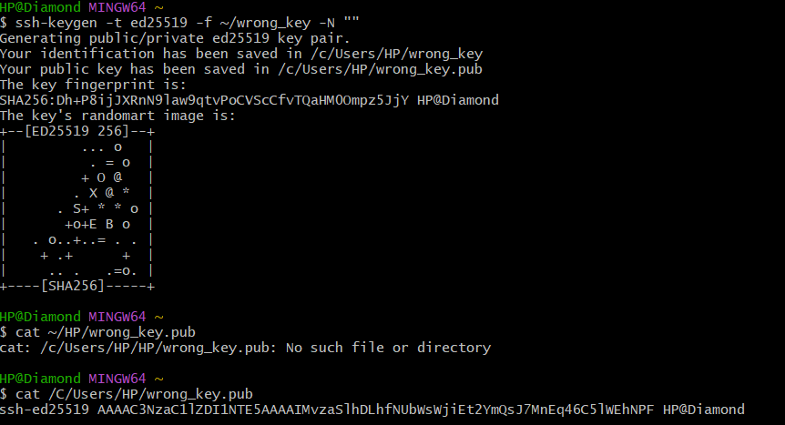

# Injection Steps Screenshots

This folder contains screenshots documenting the **failure injection process** in Lab 1.

## Images

### 1. Wrong Key Generated

### 2. Wrong Key in authorized_keys

---

These screenshots correspond to the commands and steps in `injection-steps.md`.
