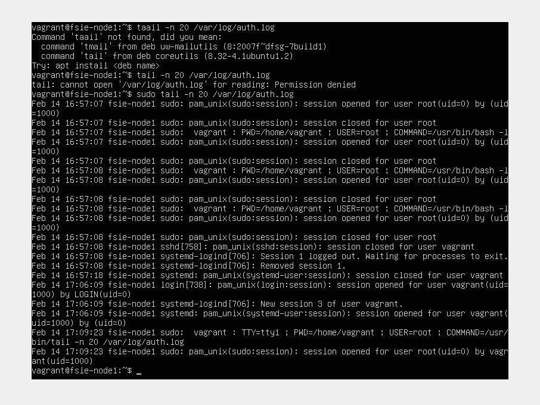
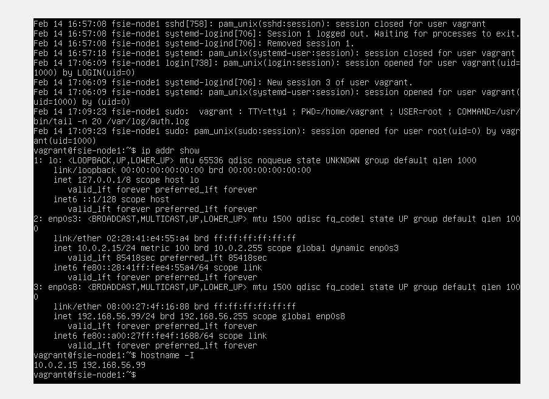

# Lab 3: Static IP Misconfiguration (Failure Injection Scenario)

## Objective

Simulate a static IP misconfiguration in a Vagrant-provisioned Ubuntu VM and analyze its impact on:

- DNS resolution
- SSH connectivity
- Cluster communication
- Host-to-VM reachability

---

## Baseline Working Configuration

```ruby
Vagrant.configure("2") do |config|
  config.vm.box = "ubuntu/jammy64"
  config.vm.hostname = "fsie-node1"

  config.vm.network "private_network", ip: "192.168.56.71"

  config.vm.provider "virtualbox" do |vb|
    vb.memory = 2048
    vb.cpus = 2
  end
end

#Expected IP: 192.168.56.71
#Hostname: fsie-node1

##Lab Phases:

#Inject Failure

#Observe Symptoms

#Troubleshoot

#Remediate

#Verify


## Failure Injection Screenshot


## Symptoms Screenshots


## Troubleshooting screenshots





## Remediation Screenshots


Final Status

✅ Failure injected
✅ Root cause confirmed
✅ Configuration restored
✅ Connectivity validated


